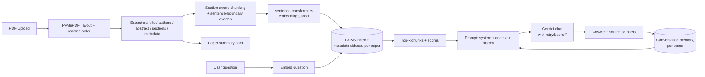

# ScholarMind AI

A RAG-based research assistant: upload a paper PDF, get a structured summary card, then chat with it, grounded in retrieval over the paper's own text, with streamed answers, source snippets, and conversation memory. Rename or delete papers in your library, export any chat as Markdown or PDF, or select multiple papers to ask comparative questions across them. No paid infrastructure required.

> This is a rebuild of an earlier prototype that had drifted into being a static PDF metadata parser. The extraction logic from that prototype was kept and improved; the RAG pipeline, FastAPI backend, and React frontend are new. See `docs/` for the original project's design notes.

## How it works



## Why these choices

- **Embeddings run locally** (`sentence-transformers`, `all-MiniLM-L6-v2`) instead of through Gemini's embedding endpoint. Embeddings happen per-chunk at upload and per-question at chat time, so routing that through a free-tier API would burn the same quota the chat completions need. Local embeddings are free, offline, fast on CPU, and 384 dimensions is plenty for single-paper retrieval.
- **FAISS for the vector store**, one index per paper. The brief's preferred default was ChromaDB, but its local backend (`chroma-hnswlib`) ships no prebuilt Windows wheel for Python 3.13 and needs the MSVC C++ Build Tools to compile from source, which isn't available in this dev environment and isn't something worth asking every future contributor to install. FAISS ships a matching wheel and was already proven working on this exact machine by the original prototype. To avoid that prototype's original bug, a raw FAISS index with no persisted link back to its chunk text/metadata, which broke the moment a process restarted with a differently-ordered chunk list, the vector store here always writes the index and a metadata sidecar (`{paper_id}.meta.json`: chunk text, section, page range) together, and always reads them back together. Same effect as a Chroma collection, same "free, local, no server" bar, just without the platform-specific build dependency.
- **Structure-aware chunking**: chunks never cross section boundaries, split on sentence boundaries (not blind word counts), and carry ~40 words of overlap between consecutive chunks in a long section so context isn't severed right at a chunk edge.
- **Gemini free tier** (`gemini-3.6-flash` by default; check `GEMINI_MODEL` in `.env.example` against whatever the current free-tier flash model is, since Google retires model IDs over time) for chat completions, with exponential-backoff retry on rate-limit/`503` errors before surfacing a clear message to the user.
- **Conversation memory** is replayed to Gemini as chat history on every turn, so follow-up questions ("what dataset did *they* use?") resolve correctly instead of each question being answered in isolation.
- **Streaming answers** over Server-Sent Events: retrieval happens eagerly so sources render immediately, then Gemini's response streams in token-by-token. It's a POST endpoint (the request body carries the question), so the browser can't use the native `EventSource` API (GET-only) - the frontend reads the response body as a stream and parses the same `event:`/`data:` framing by hand.
- **Cross-paper comparison** reuses the exact same chat/history/export code path as single-paper chat: `/api/compare/{id1,id2,...}/chat` retrieves from each paper's own FAISS index independently, labels every source with which paper it came from, and stores its conversation under a synthetic key so the comparison has its own persistent history distinct from either paper's individual chat.
- **Chat export** (Markdown or PDF) is generated from the same stored conversation turns used for the on-screen history, so what you export always matches what you see. PDF generation uses fpdf2 (pure Python, no native build step, consistent with the FAISS-over-Chroma reasoning above) with the bundled DejaVu Sans font embedded for full Unicode text, rather than the Latin-1-only core fonts fpdf2 ships by default.

## Project structure

```
backend/
  app/
    main.py              FastAPI app, CORS, error handlers
    config.py             All settings, read from environment
    exceptions.py         Custom exception types
    pdf/                  PDF -> structured Paper
      layout_analyzer.py, reading_order.py, extractors.py, pdf_processor.py
    rag/                  Retrieval-augmented chat
      chunking.py, embeddings.py, vector_store.py, gemini_client.py,
      conversation_memory.py, rag_pipeline.py
      export.py            Markdown/PDF transcript export
    assets/fonts/          bundled DejaVu Sans (Unicode PDF text, Bitstream Vera license)
    storage/paper_store.py  JSON-backed paper registry
    routes/                papers.py, chat.py, compare.py
    ingestion.py           Upload -> parse -> chunk -> embed -> index
  tests/                 pytest suite (Gemini calls are mocked)
  data/                  uploads, conversations, paper registry (gitignored)
  vector_store_data/     persisted FAISS indexes + metadata (gitignored)
frontend/
  src/
    api/client.ts         typed fetch wrapper, incl. SSE stream parsing
    pages/Dashboard.tsx    upload + library + compare-mode selection
    pages/PaperView.tsx    summary card + chat + rename
    pages/ComparePage.tsx  multi-paper chat
    components/            UploadDropzone, PaperCard, ChatPanel, ConfirmDialog, Header
docs/                    original project's design notes (kept for history)
```

## Setup

### 1. Get a free Gemini API key

Go to https://aistudio.google.com/apikey, sign in, and create a key. The free tier is generous enough for this project but does rate-limit; the backend retries automatically and surfaces a clear message if you hit the ceiling.

### 2. Backend

```bash
cd backend
python -m venv venv
source venv/Scripts/activate   # Windows Git Bash; use venv\Scripts\activate.bat for cmd.exe
pip install -r requirements.txt

cp .env.example .env
# edit .env and paste your GEMINI_API_KEY

uvicorn app.main:app --reload --port 8000
```

The API is now at `http://localhost:8000` (interactive docs at `/docs`).

### 3. Frontend

```bash
cd frontend
npm install
cp .env.example .env    # defaults already point at localhost:8000

npm run dev
```

Open `http://localhost:5173`.

### 4. Run tests

```bash
cd backend
source venv/Scripts/activate
pytest
```

Gemini calls are mocked in tests, so running the suite does not consume API quota.

## API

| Method | Path | Purpose |
|---|---|---|
| POST | `/api/papers/upload` | Upload a PDF (multipart). Returns immediately with status `processing`; parsing/indexing runs in the background. |
| GET | `/api/papers` | List all papers (library view). |
| GET | `/api/papers/{id}` | Full summary card: metadata, abstract, sections, stats. |
| PATCH | `/api/papers/{id}` | Rename a paper. |
| DELETE | `/api/papers/{id}` | Remove a paper, its vectors, and its conversation history. |
| POST | `/api/papers/{id}/chat` | Ask a question; returns a grounded answer + source snippets. |
| POST | `/api/papers/{id}/chat/stream` | Same as above, streamed over Server-Sent Events (`sources` event first, then `delta` events, then `done`/`error`). |
| GET | `/api/papers/{id}/chat/history` | Full conversation so far. |
| DELETE | `/api/papers/{id}/chat` | Clear conversation memory for a paper. |
| GET | `/api/papers/{id}/chat/export?format=markdown\|pdf` | Download the conversation as a file. |
| POST/GET/DELETE | `/api/compare/{id1,id2,...}/chat[/stream\|/history\|/export]` | Same shape as the single-paper chat endpoints, scoped to 2+ papers at once; sources are labeled with which paper they came from. |

## Error handling

| Failure | Behavior |
|---|---|
| Non-PDF or corrupt file | `400`, before any processing starts |
| Scanned/image-only PDF (no text layer) | `422` with a clear "this needs OCR first" message, detected by average extractable characters per page |
| Empty question | `400` |
| Chat before processing finishes | `409`, "still being processed" |
| Chat on a paper that failed to parse | `422` with the original parse error |
| Gemini rate limit | retried with exponential backoff (3 attempts), then `429` with a clear message |
| Gemini unreachable / no API key configured | `503` with a clear message |

## Known limitations

- Metadata/section extraction is heuristic (font size, numbered-heading regex) and tuned to common single- and IEEE-style two-column layouts, so it can misfire on unusual PDF layouts (rename the paper manually if the extracted title is wrong). This only affects the summary card; chat answers are grounded in retrieved chunk text regardless.
- A dropped connection mid-stream doesn't resume - retry/backoff only applies before the first token of a response goes out, since retrying after that would re-send the whole answer and duplicate/garble what the client already rendered. What streamed in before the drop is kept, both on screen and in the paper's saved conversation history; the user just needs to ask again to continue.
