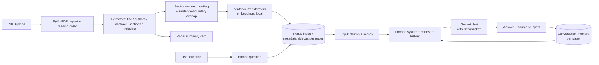

# ScholarMind AI

A RAG-based research assistant: upload a paper PDF, get a structured summary card, then chat with it — grounded in retrieval over the paper's own text, with source snippets and conversation memory. No paid infrastructure required.

> This is a rebuild of an earlier prototype that had drifted into being a static PDF metadata parser. The extraction logic from that prototype was kept and improved; the RAG pipeline, FastAPI backend, and React frontend are new. See `docs/` for the original project's design notes.

## How it works



## Why these choices

- **Embeddings run locally** (`sentence-transformers`, `all-MiniLM-L6-v2`) instead of through Gemini's embedding endpoint. Embeddings happen per-chunk at upload and per-question at chat time — routing that through a free-tier API would burn the same quota the chat completions need. Local embeddings are free, offline, fast on CPU, and 384 dimensions is plenty for single-paper retrieval.
- **FAISS for the vector store**, one index per paper. The brief's preferred default was ChromaDB, but its local backend (`chroma-hnswlib`) ships no prebuilt Windows wheel for Python 3.13 and needs the MSVC C++ Build Tools to compile from source — not available in this dev environment, and not something worth asking every future contributor to install. FAISS ships a matching wheel and was already proven working on this exact machine by the original prototype. To avoid that prototype's original bug — a raw FAISS index with no persisted link back to its chunk text/metadata, which broke the moment a process restarted with a differently-ordered chunk list — the vector store here always writes the index and a metadata sidecar (`{paper_id}.meta.json`: chunk text, section, page range) together, and always reads them back together. Same effect as a Chroma collection, same "free, local, no server" bar, just without the platform-specific build dependency.
- **Structure-aware chunking**: chunks never cross section boundaries, split on sentence boundaries (not blind word counts), and carry ~40 words of overlap between consecutive chunks in a long section so context isn't severed right at a chunk edge.
- **Gemini free tier** (`gemini-3.6-flash` by default — check `GEMINI_MODEL` in `.env.example` against whatever the current free-tier flash model is, since Google retires model IDs over time) for chat completions, with exponential-backoff retry on rate-limit/`503` errors before surfacing a clear message to the user.
- **Conversation memory** is replayed to Gemini as chat history on every turn, so follow-up questions ("what dataset did *they* use?") resolve correctly instead of each question being answered in isolation.

## Project structure

```
backend/
  app/
    main.py              FastAPI app, CORS, error handlers
    config.py             All settings, read from environment
    exceptions.py         Custom exception types
    pdf/                  PDF -> structured Paper
      layout_analyzer.py, reading_order.py, extractors.py, pdf_processor.py
    rag/                  Retrieval-augmented chat
      chunking.py, embeddings.py, vector_store.py, gemini_client.py,
      conversation_memory.py, rag_pipeline.py
    storage/paper_store.py  JSON-backed paper registry
    routes/                papers.py, chat.py
    ingestion.py           Upload -> parse -> chunk -> embed -> index
  tests/                 pytest suite (Gemini calls are mocked)
  data/                  uploads, conversations, paper registry (gitignored)
  vector_store_data/     persisted FAISS indexes + metadata (gitignored)
frontend/
  src/
    api/client.ts         typed fetch wrapper
    pages/Dashboard.tsx    upload + library
    pages/PaperView.tsx    summary card + chat
    components/            UploadDropzone, PaperCard, ChatPanel, Header
docs/                    original project's design notes (kept for history)
```

## Setup

### 1. Get a free Gemini API key

Go to https://aistudio.google.com/apikey, sign in, and create a key. The free tier is generous enough for this project but does rate-limit — the backend retries automatically and surfaces a clear message if you hit the ceiling.

### 2. Backend

```bash
cd backend
python -m venv venv
source venv/Scripts/activate   # Windows Git Bash; use venv\Scripts\activate.bat for cmd.exe
pip install -r requirements.txt

cp .env.example .env
# edit .env and paste your GEMINI_API_KEY

uvicorn app.main:app --reload --port 8000
```

The API is now at `http://localhost:8000` (interactive docs at `/docs`).

### 3. Frontend

```bash
cd frontend
npm install
cp .env.example .env    # defaults already point at localhost:8000

npm run dev
```

Open `http://localhost:5173`.

### 4. Run tests

```bash
cd backend
source venv/Scripts/activate
pytest
```

Gemini calls are mocked in tests — running the suite does not consume API quota.

## API

| Method | Path | Purpose |
|---|---|---|
| POST | `/api/papers/upload` | Upload a PDF (multipart). Returns immediately with status `processing`; parsing/indexing runs in the background. |
| GET | `/api/papers` | List all papers (library view). |
| GET | `/api/papers/{id}` | Full summary card: metadata, abstract, sections, stats. |
| DELETE | `/api/papers/{id}` | Remove a paper, its vectors, and its conversation history. |
| POST | `/api/papers/{id}/chat` | Ask a question; returns a grounded answer + source snippets. |
| GET | `/api/papers/{id}/chat/history` | Full conversation so far. |
| DELETE | `/api/papers/{id}/chat` | Clear conversation memory for a paper. |

## Error handling

| Failure | Behavior |
|---|---|
| Non-PDF or corrupt file | `400`, before any processing starts |
| Scanned/image-only PDF (no text layer) | `422` with a clear "this needs OCR first" message, detected by average extractable characters per page |
| Empty question | `400` |
| Chat before processing finishes | `409` — "still being processed" |
| Chat on a paper that failed to parse | `422` with the original parse error |
| Gemini rate limit | retried with exponential backoff (3 attempts), then `429` with a clear message |
| Gemini unreachable / no API key configured | `503` with a clear message |

## Known limitations

- Metadata/section extraction is heuristic (font size, numbered-heading regex) and tuned to common single- and IEEE-style two-column layouts — it can misfire on unusual PDF layouts. This only affects the summary card; chat answers are grounded in retrieved chunk text regardless.
- Multi-paper cross-document querying ("compare the methodology of these two papers") is not implemented — each chat is scoped to one paper. The library view (list/open/delete multiple papers) is in place as the foundation for this stretch goal.
- Chat responses are not streamed token-by-token; the full answer returns once generation completes.
