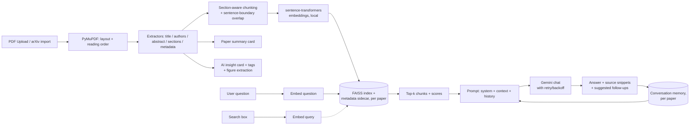

# ScholarMind AI

A RAG-based research assistant: upload a paper PDF, get a structured summary card, then chat with it, grounded in retrieval over the paper's own text, with streamed answers, source snippets, and conversation memory. Rename or delete papers in your library, export any chat as Markdown or PDF, or select multiple papers to ask comparative questions across them. No paid infrastructure required.

Beyond the core upload -> chat loop, it also acts as a broader research assistant:

- **AI insight cards** - an auto-generated Problem / Method / Key Results / Limitations / Contributions breakdown for every paper, plus a reading-level toggle (Simple / Standard / Expert) and Gemini-suggested follow-up questions after every answer.
- **Library-wide intelligence** - semantic search across your *entire* library (not just one paper), and automatic topic tags used as filter chips on the dashboard.
- **Connected research** - a "Related work" panel powered by the free Semantic Scholar API, and importing a paper directly by arXiv id/URL instead of only local file upload.
- **Figures & multimodal Q&A** - figures/charts/tables are extracted from the PDF and shown on the summary card; click one to ask Gemini questions about that specific image.

> This is a rebuild of an earlier prototype that had drifted into being a static PDF metadata parser. The extraction logic from that prototype was kept and improved; the RAG pipeline, FastAPI backend, and React frontend are new. See `docs/` for the original project's design notes.

## How it works



## Why these choices

- **Embeddings run locally** (`sentence-transformers`, `all-MiniLM-L6-v2`) instead of through Gemini's embedding endpoint. Embeddings happen per-chunk at upload and per-question at chat time, so routing that through a free-tier API would burn the same quota the chat completions need. Local embeddings are free, offline, fast on CPU, and 384 dimensions is plenty for single-paper retrieval.
- **FAISS for the vector store**, one index per paper. The brief's preferred default was ChromaDB, but its local backend (`chroma-hnswlib`) ships no prebuilt Windows wheel for Python 3.13 and needs the MSVC C++ Build Tools to compile from source, which isn't available in this dev environment and isn't something worth asking every future contributor to install. FAISS ships a matching wheel and was already proven working on this exact machine by the original prototype. To avoid that prototype's original bug, a raw FAISS index with no persisted link back to its chunk text/metadata, which broke the moment a process restarted with a differently-ordered chunk list, the vector store here always writes the index and a metadata sidecar (`{paper_id}.meta.json`: chunk text, section, page range) together, and always reads them back together. Same effect as a Chroma collection, same "free, local, no server" bar, just without the platform-specific build dependency.
- **Structure-aware chunking**: chunks never cross section boundaries, split on sentence boundaries (not blind word counts), and carry ~40 words of overlap between consecutive chunks in a long section so context isn't severed right at a chunk edge.
- **Gemini free tier** (`gemini-3.6-flash` by default; check `GEMINI_MODEL` in `.env.example` against whatever the current free-tier flash model is, since Google retires model IDs over time) for chat completions, with exponential-backoff retry on rate-limit/`503` errors before surfacing a clear message to the user.
- **Conversation memory** is replayed to Gemini as chat history on every turn, so follow-up questions ("what dataset did *they* use?") resolve correctly instead of each question being answered in isolation.
- **Streaming answers** over Server-Sent Events: retrieval happens eagerly so sources render immediately, then Gemini's response streams in token-by-token. It's a POST endpoint (the request body carries the question), so the browser can't use the native `EventSource` API (GET-only) - the frontend reads the response body as a stream and parses the same `event:`/`data:` framing by hand. A dropped connection mid-stream doesn't retry from scratch (that would duplicate/garble what already rendered) - it raises and keeps whatever streamed in so far, both on screen and in saved history.
- **Cross-paper comparison** reuses the exact same chat/history/export code path as single-paper chat: `/api/compare/{id1,id2,...}/chat` retrieves from each paper's own FAISS index independently, labels every source with which paper it came from, and stores its conversation under a synthetic key so the comparison has its own persistent history distinct from either paper's individual chat.
- **Chat export** (Markdown or PDF) is generated from the same stored conversation turns used for the on-screen history, so what you export always matches what you see. PDF generation uses fpdf2 (pure Python, no native build step, consistent with the FAISS-over-Chroma reasoning above) with the bundled DejaVu Sans font embedded for full Unicode text, rather than the Latin-1-only core fonts fpdf2 ships by default.
- **AI insight cards and tags are best-effort, generated once at ingestion** via Gemini's JSON output mode, stored on the paper record. A failure here (rate limit, outage) never blocks the paper from becoming chattable - it just shows "unavailable" instead of the card. Follow-up question suggestions use the same JSON-mode call, generated fresh after every answer.
- **Library search reuses the per-paper FAISS indexes** rather than building a second shared index: the query is embedded once, then queried against every ready paper's own index and the results are merged and re-ranked by score. Simple and fine at personal-library scale; would need a shared index to scale to hundreds of papers.
- **Related papers via Semantic Scholar's public Graph API** (no key required for personal use) - genuinely connects the library to the wider literature instead of being a closed corpus. It's best-effort: a network failure or rate limit degrades to an empty (uncached) result rather than an error, so it retries cleanly on the next visit instead of permanently hiding results behind a stale failure.
- **arXiv import extracts only the numeric/alphanumeric arXiv id** from whatever the user pastes (bare id or any arxiv.org URL shape) and always builds the download URL against the fixed `arxiv.org` host itself - the user-supplied string never becomes part of an outbound request URL's host, closing off SSRF via that field.
- **Figure extraction** pulls embedded raster images per page via PyMuPDF, filtering out small icons/decorative marks, with a lightweight caption heuristic (first "Figure N"/"Table N" text block on the same page - a page-level association, not a precise spatial match). Multimodal Q&A sends the image bytes directly to Gemini alongside the caption and question.
- **Interrupted ingestion self-heals on restart**: if the server dies mid-ingestion (a crash, or the dev `--reload` autoreloader killing a background task), the uploaded PDF is still on disk, so a startup hook re-runs ingestion for anything still stuck in "processing" rather than leaving it stuck forever.
- **Icons are hand-drawn inline SVG** (`frontend/src/components/icons.tsx`), not emoji or raster PNGs: crisp at any DPI, themeable via `currentColor`, no extra image request or package, and consistent with how professional web UIs are actually built.

## Project structure

```
backend/
  app/
    main.py              FastAPI app, CORS, error handlers, startup recovery
    config.py             All settings, read from environment
    exceptions.py         Custom exception types
    pdf/                  PDF -> structured Paper
      layout_analyzer.py, reading_order.py, extractors.py, pdf_processor.py
      figure_extractor.py  embedded figure/table extraction + caption heuristic
    rag/                  Retrieval-augmented chat
      chunking.py, embeddings.py, vector_store.py, gemini_client.py,
      conversation_memory.py, rag_pipeline.py
      export.py            Markdown/PDF transcript export
      enrichment.py         insight cards, tags, follow-up suggestions (Gemini JSON mode)
      library_search.py     semantic search across every paper's index
      discovery.py          Semantic Scholar related-papers + arXiv import
    assets/fonts/          bundled DejaVu Sans (Unicode PDF text, Bitstream Vera license)
    storage/paper_store.py  JSON-backed paper registry
    routes/                papers.py, chat.py, compare.py, figures.py
    ingestion.py           Upload -> parse -> chunk -> embed -> index -> figures -> enrich
  tests/                 pytest suite (Gemini + external HTTP calls are mocked)
  data/                  uploads, conversations, figures, paper registry (gitignored)
  vector_store_data/     persisted FAISS indexes + metadata (gitignored)
frontend/
  src/
    api/client.ts         typed fetch wrapper, incl. SSE stream parsing
    pages/Dashboard.tsx    upload + arXiv import + library search + tag filters + compare-mode
    pages/PaperView.tsx    summary card + insight card + figures + related work + chat + rename
    pages/ComparePage.tsx  multi-paper chat
    components/            UploadDropzone, ArxivImportBar, PaperCard, ChatPanel,
                           FigureLightbox, ConfirmDialog, Header
    components/icons.tsx   hand-drawn inline SVG icon set (no emoji, no image files)
docs/                    original project's design notes (kept for history)
```

## Setup

### 1. Get a free Gemini API key

Go to https://aistudio.google.com/apikey, sign in, and create a key. The free tier is generous enough for this project but does rate-limit; the backend retries automatically and surfaces a clear message if you hit the ceiling.

### 2. Backend

**Requires Python 3.13** (not 3.14+ yet) - `faiss-cpu`, `pydantic-core`, and `tokenizers` don't ship prebuilt wheels for 3.14 on Windows at the time of writing, and building them from source needs the MSVC C++ Build Tools installed. If you only have a newer Python, install 3.13 alongside it (the Windows `py` launcher makes this easy: `py -3.13 -m venv venv`).

```bash
cd backend
python -m venv venv            # or: py -3.13 -m venv venv
source venv/Scripts/activate   # Windows Git Bash; use venv\Scripts\activate.bat for cmd.exe
pip install -r requirements.txt

cp .env.example .env
# edit .env and paste your GEMINI_API_KEY

uvicorn app.main:app --reload --port 8000
```

The API is now at `http://localhost:8000` (interactive docs at `/docs`).

> Careful with `--reload` while a paper is mid-upload: editing backend files triggers a worker restart that kills any in-flight background ingestion task. It's not lost - the startup hook resumes it - but you'll see the paper flip to "processing" again briefly (or "failed" if the file underneath it is also gone).

### 3. Frontend

```bash
cd frontend
npm install
cp .env.example .env    # defaults already point at localhost:8000

npm run dev
```

Open `http://localhost:5173`.

### 4. Run tests

```bash
cd backend
source venv/Scripts/activate
pytest
```

Gemini calls and external HTTP calls (Semantic Scholar, arXiv) are mocked in tests, so running the suite does not consume API quota or hit third-party rate limits.

## API

| Method | Path | Purpose |
|---|---|---|
| POST | `/api/papers/upload` | Upload a PDF (multipart). Returns immediately with status `processing`; parsing/indexing runs in the background. |
| POST | `/api/papers/import-arxiv` | Import a paper directly by arXiv id or URL instead of uploading a file. |
| GET | `/api/papers` | List all papers (library view), each with its topic tags. |
| GET | `/api/papers/search?q=...` | Semantic search across every paper's own text, merged and ranked by relevance. |
| GET | `/api/papers/{id}` | Full summary card: metadata, abstract, sections, stats, insight card, figures. |
| GET | `/api/papers/{id}/related` | Related papers from Semantic Scholar (cached after a successful lookup). |
| PATCH | `/api/papers/{id}` | Rename a paper (also invalidates its cached related-papers, since a bad title is often exactly why you're renaming). |
| DELETE | `/api/papers/{id}` | Remove a paper, its vectors, its figures, and its conversation history. |
| POST | `/api/papers/{id}/chat` | Ask a question; returns a grounded answer, source snippets, and suggested follow-ups. Body accepts `reading_level`: `default` \| `eli5` \| `expert`. |
| POST | `/api/papers/{id}/chat/stream` | Same as above, streamed over Server-Sent Events (`sources`, then `delta`, then `followups`, then `done`/`error`). |
| GET | `/api/papers/{id}/chat/history` | Full conversation so far. |
| DELETE | `/api/papers/{id}/chat` | Clear conversation memory for a paper. |
| GET | `/api/papers/{id}/chat/export?format=markdown\|pdf` | Download the conversation as a file. |
| GET | `/api/papers/{id}/figures/{figure_id}` | The extracted figure/table image. |
| POST | `/api/papers/{id}/figures/{figure_id}/ask` | Multimodal Q&A about one specific figure. |
| POST/GET/DELETE | `/api/compare/{id1,id2,...}/chat[/stream\|/history\|/export]` | Same shape as the single-paper chat endpoints, scoped to 2+ papers at once; sources are labeled with which paper they came from. |

## Error handling

| Failure | Behavior |
|---|---|
| Non-PDF or corrupt file | `400`, before any processing starts |
| Scanned/image-only PDF (no text layer) | `422` with a clear "this needs OCR first" message, detected by average extractable characters per page |
| Empty question | `400` |
| Chat before processing finishes | `409`, "still being processed" |
| Chat on a paper that failed to parse | `422` with the original parse error |
| Gemini rate limit | retried with exponential backoff (3 attempts), then `429` with a clear message |
| Gemini unreachable / no API key configured | `503` with a clear message |
| Invalid or unreachable arXiv id/URL | `422` with a clear message, before anything is saved |
| Fewer than 2 papers selected to compare | `400` |
| Server restarts mid-ingestion | self-heals on next boot (resumes if the file is still there, else marks `failed`) |

## Known limitations

- Metadata/section extraction is heuristic (font size, numbered-heading regex) and tuned to common single- and IEEE-style two-column layouts, so it can misfire on unusual PDF layouts (rename the paper manually if the extracted title is wrong - this also fixes related-work search, since it re-runs against the corrected title). This only affects the summary card; chat answers are grounded in retrieved chunk text regardless.
- Semantic Scholar's unauthenticated API has a fairly tight rate limit; heavy use of "Related work" across many papers in a short window will start returning empty results until it resets. These aren't cached as a false negative - the panel just retries on the next visit.
- Figure captions are a page-level heuristic (first "Figure N"/"Table N" text on the same page as the image), not a precise spatial match - a page with multiple figures may show the same caption on more than one.
- PDF export's embedded font (DejaVu Sans) covers Latin, Cyrillic, Greek, and common symbols, but not CJK or other non-Latin scripts. The Markdown export has no such limitation.
